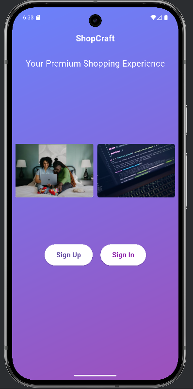

# 🛒 Flutter Shopping App

## 📌 Project Overview
A complete shopping mobile app built with Flutter & Dart.  
It includes user authentication, product browsing, cart interaction, and responsive UI.

---

## 🚀 Features
- Aesthetic **Welcome Screen** with images 
- **Sign Up / Sign In** forms with validation.
- **Smooth navigation & transitions**.
- **Products Home Screen** with:
    - PageView for featured products.
    - GridView for product cards.
    - "Hot Offers" section with ListView.
- **Localization** (Arabic support).
- Clean & modular code structure.

---

## 🛠 Tools Used
- Flutter SDK
- Dart
-  Android Studio
- GitHub
- SharedPreferences (local storage)
- Flutter Intl (for localization)

---

## 📸 Screenshots
### Welcome Screen


### Sing Up Screen


### Sign In Screen


### successful Screen


### Product Screen


### Product & Hot offers Screen


---

## ▶️ How to Run
```bash
git clone <repo-link>
cd shopping_app
flutter pub get
flutter run

